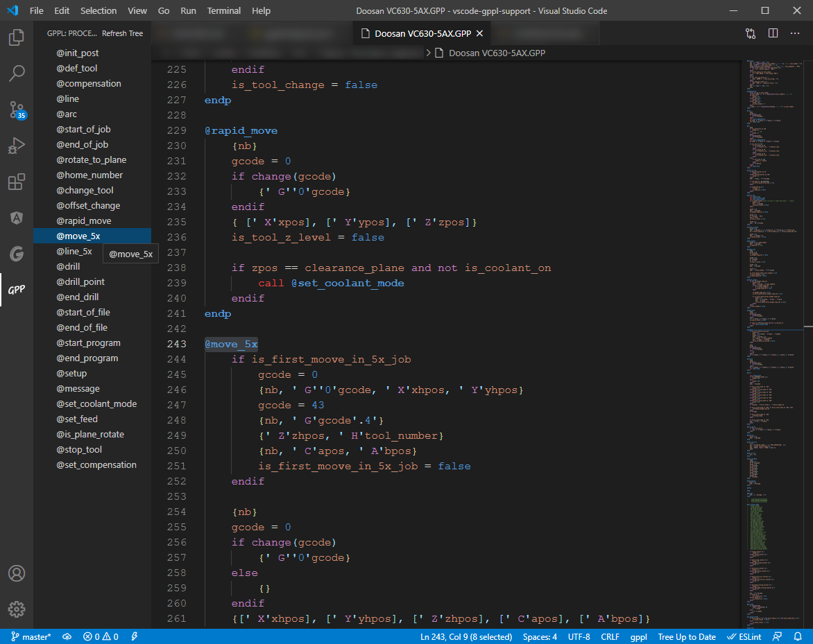
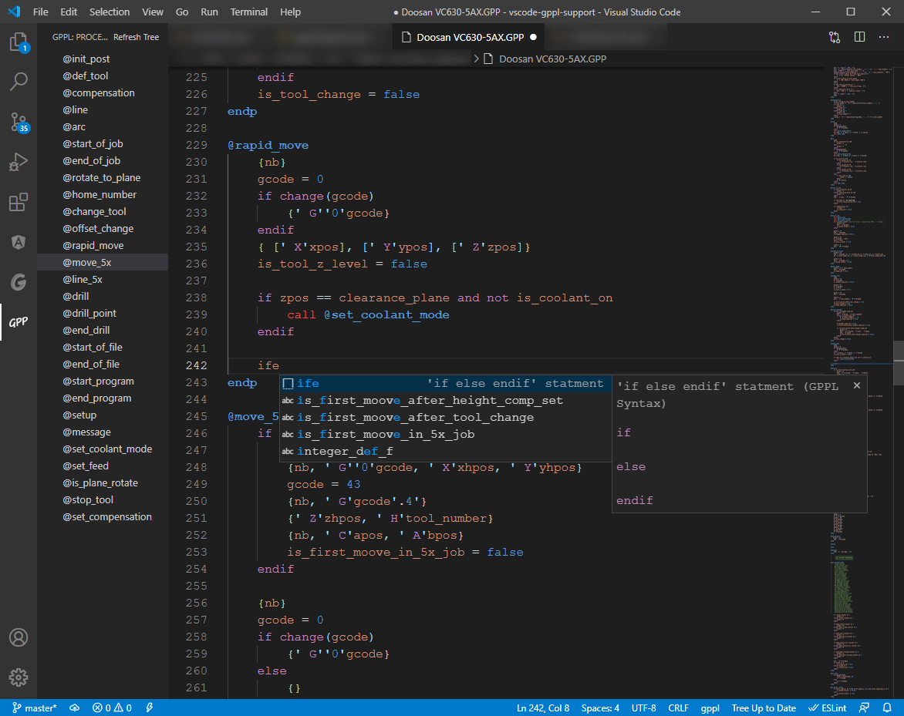

# GPPL language support for VSCode | README

This extension provides GPPL language support for VSCode

## Features

* Syntax highlighting
* Sidebar with procedures tree view
* Autocomplete code
  * prefix "nb" - Write new block.
  * prefix "nl" - Write new line.
  * prefix "ta" - Write debug code trace procedure.
  * prefix "if" - Write 'if endif' statment.
  * prefix "ife" - Write 'if else endif' statment.
  * prefix "whi" - Write 'while endw' statment.
  * prefix "prc" - Write new procedure.

Syntax highlighting:

Sidebar with procedures tree view:

Autocomplete code:

> Type 'lop' to see all GPPL logical operators.

> Type 'logf' to see all GPPL logical functions.

> Type 'strf' to see all GPPL string functions.

> Type 'numf' to see all GPPL numeric functions.

> Type 'gpm' to see all GPPL modifiers.

## Requirements

There are no dependencies in this extension.

## Extension Settings

There are no special settings in this extension.

## Known Issues

There are no known issues with this extension.

## Release Notes

This is the first release of this extension.

### 1.0.0

The initial release of vscode-gppl-support

-----------------------------------------------------------------------------------------------------------

**Enjoy!**
