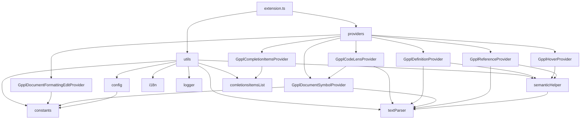

# План аудита кода расширения VS Code GPPL Support

## Обзор проекта

Расширение предоставляет поддержку языка GPP (SolidCAM) в VS Code, включая:

- Автодополнение кода
- Подсветку синтаксиса
- Навигацию к определению
- Поиск ссылок
- Форматирование документа
- Document symbols (outline)

## Результаты аудита

### 1. Состояние XML-документации

#### ✅ Хорошо документированные файлы

| Файл                                                                                           | Оценка | Комментарий                                   |
| ---------------------------------------------------------------------------------------------- | ------ | --------------------------------------------- |
| [`extension.ts`](src/extension.ts)                                                             | Хорошо | Документированы функции activate и deactivate |
| [`providers.ts`](src/providers/providers.ts)                                                   | Хорошо | Документированы интерфейс и объект providers  |
| [`GpplCompletionItemsProvider.ts`](src/providers/GpplCompletionItemsProvider.ts)               | Хорошо | Полная документация класса и методов          |
| [`GpplDefinitionProvider.ts`](src/providers/GpplDefinitionProvider.ts)                         | Хорошо | Полная документация                           |
| [`GpplDocumentFormattingEditProvider.ts`](src/providers/GpplDocumentFormattingEditProvider.ts) | Хорошо | Полная документация                           |
| [`GpplDocumentSymbolProvider.ts`](src/providers/GpplDocumentSymbolProvider.ts)                 | Хорошо | Полная документация                           |
| [`GpplHoverProvider.ts`](src/providers/GpplHoverProvider.ts)                                   | Хорошо | Полная документация                           |
| [`GpplReferenceProvider.ts`](src/providers/GpplReferenceProvider.ts)                           | Хорошо | Полная документация                           |
| [`utils.ts`](src/utils/utils.ts)                                                               | Хорошо | Документированы все экспорты                  |
| [`constants.ts`](src/utils/constants.ts)                                                       | Хорошо | Документированы класс и основные элементы     |
| [`config.ts`](src/utils/config.ts)                                                             | Хорошо | Полная документация                           |
| [`i18n.ts`](src/utils/i18n.ts)                                                                 | Хорошо | Полная документация                           |
| [`logger.ts`](src/utils/logger.ts)                                                             | Хорошо | Полная документация                           |
| [`semanticHelper.ts`](src/utils/semanticHelper.ts)                                             | Хорошо | Полная документация                           |
| [`textParser.ts`](src/utils/textParser.ts)                                                     | Хорошо | Полная документация                           |

#### ⚠️ Файлы с замечаниями

| Файл                                                               | Проблема                           |
| ------------------------------------------------------------------ | ---------------------------------- |
| [`GpplCodeLensProvider.ts`](src/providers/GpplCodeLensProvider.ts) | Приватные методы без тега @private |

---

### 2. Выявленные проблемы

#### 2.1 Проблемы с типизацией

**Файл:** [`GpplCompletionItemsProvider.ts`](src/providers/GpplCompletionItemsProvider.ts:62-67)

```typescript
// Проблема: использование any вместо конкретных типов
provideCompletionItems(
  document: any,      // Должен быть TextDocument
  position: any,      // Должен быть Position
  token: any,         // Должен быть CancellationToken
  context: any        // Должен быть CompletionContext
): ProviderResult<CompletionItem[]>
```

#### 2.2 Дублирование кода

**Файл:** [`GpplHoverProvider.ts`](src/providers/GpplHoverProvider.ts:46-169)

Метод `provideHover` содержит 5 почти идентичных блоков кода для обработки:

- Глобальных массивов
- Локальных массивов
- Глобальных переменных
- Локальных переменных
- Процедур

Рекомендация: Вынести общую логику в приватный метод.

#### 2.3 Опечатки в коде

**Файл:** [`semanticHelper.ts`](src/utils/semanticHelper.ts:538)

```typescript
// Опечатка: Globall вместо Global
isThisGloballUserArray(name: string): boolean {
```

Примечание: Уже есть исправленный метод [`isThisGlobalUserArray`](src/utils/semanticHelper.ts:543), но старый оставлен для обратной совместимости.

#### 2.4 Неиспользуемый код

**Файл:** [`config.ts`](src/utils/config.ts:16-25)

```typescript
// Тип IgpplSettings определён, но нигде не используется
type IgpplSettings = {
  colorization: boolean;
  machine: string;
  trAutoRef: boolean;
  statusEnabled: boolean;
};
```

#### 2.5 Проблемы с логикой

**Файл:** [`config.ts`](src/utils/config.ts:105-119)

```typescript
setParam(param: string, value: any, global = true): boolean {
  try {
    this.config.update(param, value, global);
  } catch (err) {
    return false;
  }

  this.reloadConfig();

  // Проблема: проверка всегда true после reloadConfig()
  if (this.config !== undefined) {
    return true;
  } else {
    return false;
  }
}
```

#### 2.6 Недостающие XML-комментарии

**Файл:** [`GpplCodeLensProvider.ts`](src/providers/GpplCodeLensProvider.ts:42-88)

Приватные методы без тега `@private`:

- `buildCodeLenses`
- `escapeRegExp`
- `flattenSymbols`

**Файл:** [`constants.ts`](src/utils/constants.ts:5-10)

Глобальные переменные без документации:

- `gpp`
- `configurationProperties`

**Файл:** [`semanticHelper.ts`](src/utils/semanticHelper.ts:617)

Приватное поле без документации:

- `debounceTimer`

---

### 3. Рекомендации по рефакторингу

#### 3.1 Исправление типов (Высокий приоритет)

Заменить `any` на конкретные типы в [`GpplCompletionItemsProvider.ts`](src/providers/GpplCompletionItemsProvider.ts):

```typescript
provideCompletionItems(
  document: TextDocument,
  position: Position,
  token: CancellationToken,
  context: CompletionContext
): ProviderResult<CompletionItem[]>
```

#### 3.2 Рефакторинг GpplHoverProvider (Средний приоритет)

Создать вспомогательный метод для устранения дублирования:

```typescript
private appendVariableInfo(
  hoverContent: MarkdownString,
  gppVar: IGpplVariable | undefined,
  varType: string
): void {
  if (gppVar) {
    hoverContent.appendCodeblock(
      `${gppVar.scope} ${gppVar.type} ${gppVar.name} ; (${varType})`,
      utils.constants.languageId
    );
  }
  if (gppVar?.references) {
    const rf = gppVar.references.length > 1 ? 'references' : 'reference';
    hoverContent.appendMarkdown(
      `\n---\nFound \`${gppVar.references.length}\` ${rf}`
    );
  }
  if (gppVar?.info) {
    hoverContent.appendMarkdown(`\n\n--- \n${gppVar.info}`);
  }
}
```

#### 3.3 Удаление неиспользуемого кода (Низкий приоритет)

Удалить тип `IgpplSettings` из [`config.ts`](src/utils/config.ts) или использовать его.

#### 3.4 Исправление логики setParam (Средний приоритет)

```typescript
setParam(param: string, value: any, global = true): boolean {
  try {
    this.config.update(param, value, global);
    this.reloadConfig();
    return this.config.get(param) === value;
  } catch (err) {
    return false;
  }
}
```

#### 3.5 Дополнение XML-документации

Добавить недостающие теги `@private` для приватных методов и документацию для полей.

---

## План работ

### Этап 1: Исправление критических проблем

- [ ] Исправить типы в `GpplCompletionItemsProvider.ts` (заменить any на конкретные типы)
- [ ] Добавить импорты для `TextDocument`, `Position`, `CancellationToken`, `CompletionContext`

### Этап 2: Рефакторинг

- [ ] Рефакторинг `GpplHoverProvider.ts` - вынести общую логику в приватный метод
- [ ] Исправить логику метода `setParam` в `config.ts`
- [ ] Удалить или использовать тип `IgpplSettings`

### Этап 3: Документация

- [ ] Добавить теги `@private` в `GpplCodeLensProvider.ts` для методов:
  - `buildCodeLenses`
  - `escapeRegExp`
  - `flattenSymbols`
- [ ] Документировать переменные в `constants.ts`:
  - `gpp`
  - `configurationProperties`
- [ ] Документировать поле `debounceTimer` в `semanticHelper.ts`
- [ ] Добавить тег `@public` для публичных методов в `semanticHelper.ts`

### Этап 4: Опциональные улучшения

- [ ] Рассмотреть удаление метода `isThisGloballUserArray` (с опечаткой) после проверки использования
- [ ] Добавить примеры использования в XML-документацию для ключевых классов

---

## Архитектура проекта



---

## Заключение

Код расширения в целом хорошо документирован и структурирован. Основные проблемы:

1. Использование типа `any` в одном месте
2. Дублирование кода в `GpplHoverProvider`
3. Небольшие проблемы с логикой и неиспользуемый код
4. Недостающие теги `@private` в некоторых методах

Рекомендуется выполнить все этапы плана для улучшения качества кода.
